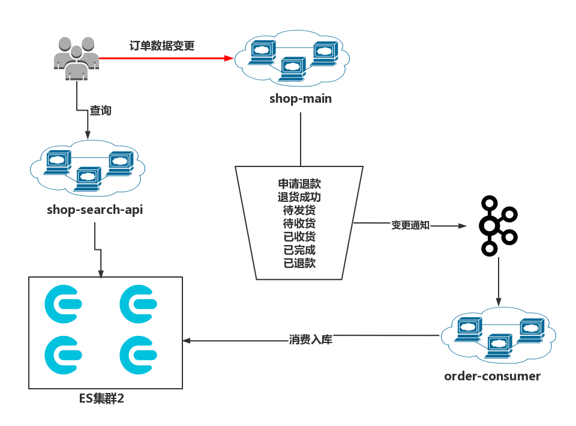

# order-consumer

## 项目介绍
海量数据高并发场景，构建Go+ES8企业级搜索微服务 订单数据同步队列消耗 服务代码

order-consumer作为shop商城消费者，下单后，订单信息入kafka,此服务作为消费端，从kafka中消费订单信息后写入ES

order-consumer作为为订单消费微服务，使用go语言开发。
作为shop-main商城订单消费者，订单数据变更后，shop-main将商品变更信息入kafka,order-consumer微服务作为消费端，从kafka中消费订单信息后写入ES
商城服务地址：https://github.com/HeRedBo/shop-main

## 技术栈

1. elasticsearch
2. kafka
3. mongoDB 
4. logger 日志库
3. ~~promethues~~

## 运行方式
1. 项目根目录下执行 go run main.go
2. 项目根目录下执行 go build main.go ,直接运行生成的main程序

商品数据变更处理流程如下：
